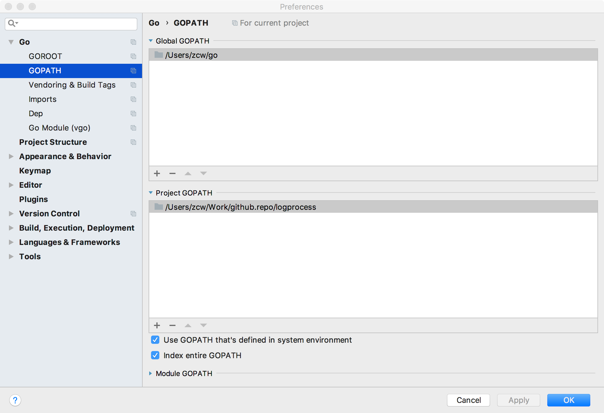

# 日志处理

本人go语言几乎0基础，意在通过慕课网该课程学习语法，该项目代码都是对着视频敲的，小改动。

- [慕课网课程--Go并发编程案例解析](https://www.imooc.com/learn/982)

- [讲师github](https://github.com/itsmikej/imooc_logprocess)

- [go语言菜鸟教程](http://www.runoob.com/go/go-tutorial.html)

### ide设置



### chapter1

创建空壳，模拟读取和写入

```sh
cd src/imooc
go run main1.go
```

### chapter2

优化结构，接口化

```sh
cd src/imooc
go run main2.go
```

### chapter3

完成读取模块

```sh
touch access.log
cd src/imooc
go run main3.go

echo 'test message' >> access.log
```

### chapter4

完成解析模块

```sh
go run main4.go
echo '192.168.2.163 - - [17/Jan/2019:15:56:03 +0800] "GET /v2/getAppUpdate HTTP/1.1" 200 2086 "-" "okhttp/3.8.0"' >> access.log
```

### chapter5

完成写入模块